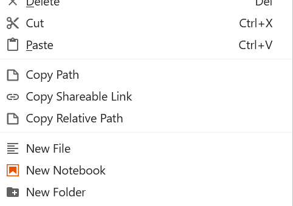

# Copy Relative Path

> Adds **'Copy Relative Path'** to a context menu of JupyterLab file browser.

This extension would be useful when specifying a file or a directory from a notebook. The path is relative to an active document; the button will hide when an active window does not provide a reference path; i.e. when a Launch page or a Console window is active.



# Install

```shell
pip install jupyterlab-copy-relative-path
```
